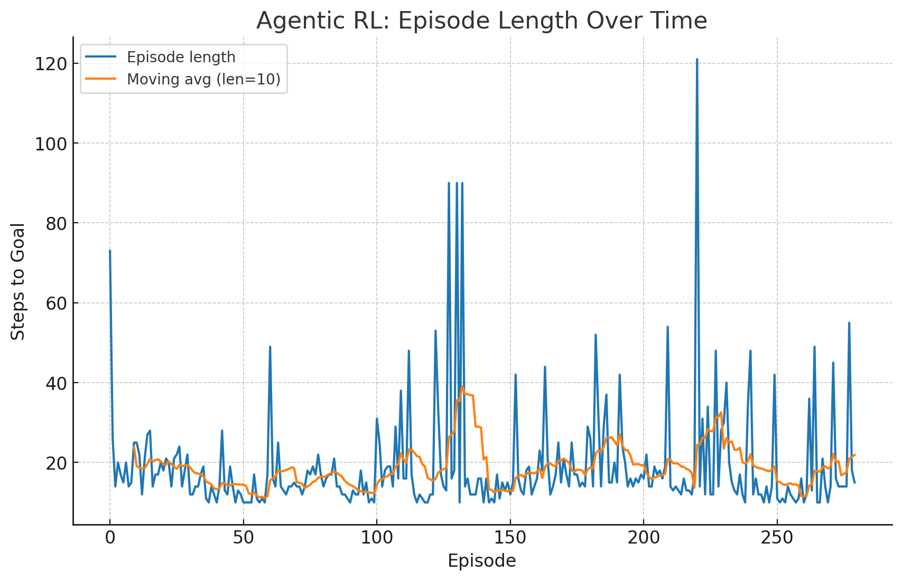
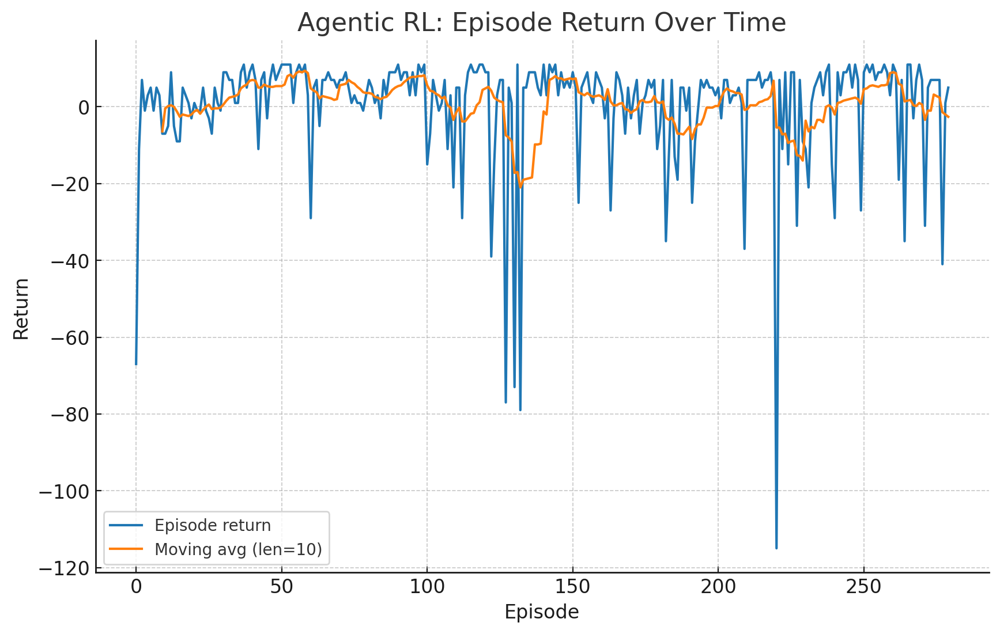

# Agentic RL: Dyna‑Q + Planning + Reflection + Tool‑Use

This repo demonstrates a lightweight **Agentic Reinforcement Learning** loop on a toy GridWorld:
- **RL core:** Q‑learning
- **Planning:** Dyna‑Q model updates each step
- **Reflection:** adapt `epsilon` and `planning_steps` when returns stop improving
- **Tool‑use:** call a BFS shortest‑path *planner* when episodes appear stuck; bias Q along that path

> Built to be small, readable, and hackable for class demos or quick experiments.

---

## 🚀 How to Run

```bash
python agentic_rl_demo.py
```

The script will train the agent and print a final greedy rollout. You can also open the notebook/cell that generated the figures here.

### Dependencies
- Python 3.9+
- `numpy`, `matplotlib`

---

## 🧠 Algorithm Overview

1. **Interact** with the GridWorld (ε‑greedy policy).
2. **Learn** with Q‑learning.
3. **Model** each transition `(s,a) -> (s', r)` and **plan** `N` Dyna‑Q updates per step.
4. **Reflect** after each episode: if no improvement for several episodes, decrease exploration and increase planning.
5. If an episode is **dragging** (heuristic), **call BFS** to find a shortest path from current state to goal and *nudge* Q‑values along that route.

---

## 📊 Learning Curves

**Episode length:**  


**Episode return:**  


---

## 🗺️ Final Greedy Path (ASCII)

Below is the final greedy rollout with wind disabled for clarity. `S` = start, `G` = goal, `#` = wall, `*` = path.

```
S*....
.*#...
**#...
*.###.
*..***
****.G
```

Reached goal: **True**  
Total reward (greedy run): **7.0**  
Steps: **14**

---

## 🧩 Key Classes & Functions

- `GridWorld`: tiny stochastic grid environment with walls and wind.
- `AgenticDynaQ`:
  - Q‑table, Dyna‑Q model, reflection logic.
  - `act_with_tool_if_stuck(...)` calls `bfs_shortest_path(...)` and biases Q along that path.
- `bfs_shortest_path(...)`: external *planning tool*.
- `train_agentic_rl(...)`: end‑to‑end training loop (in notebook) or `train(...)` in the saved script.

---

## 🔧 Useful Knobs

- `epsilon` (exploration), `planning_steps` (Dyna‑Q depth)
- `wind_prob` (stochasticity), `intrinsic_loop_penalty` (discourage dithering)
- Walls, start/goal layout

Try making the maze nastier or raising the wind, then watch how reflection and tool‑use help.

---

## 📁 Files

- `agentic_rl_demo.py` – standalone script
- `README_Agentic_RL.md` – this file
- `episode_length.png`, `episode_return.png` – charts

---

*Generated 2025-08-22 16:13:40Z*
